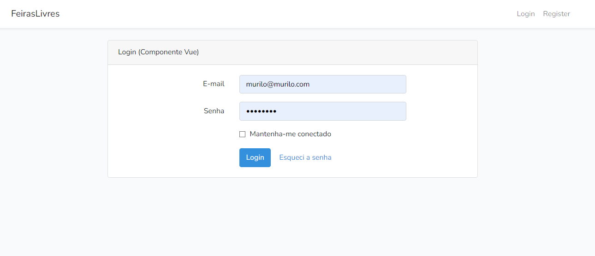
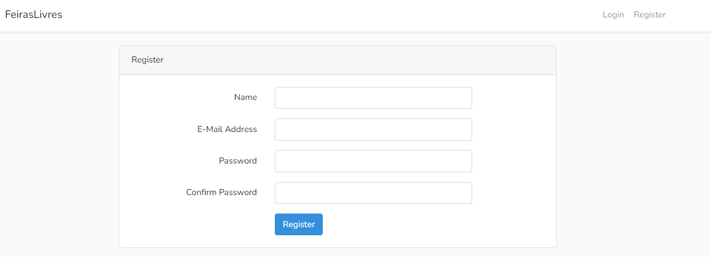
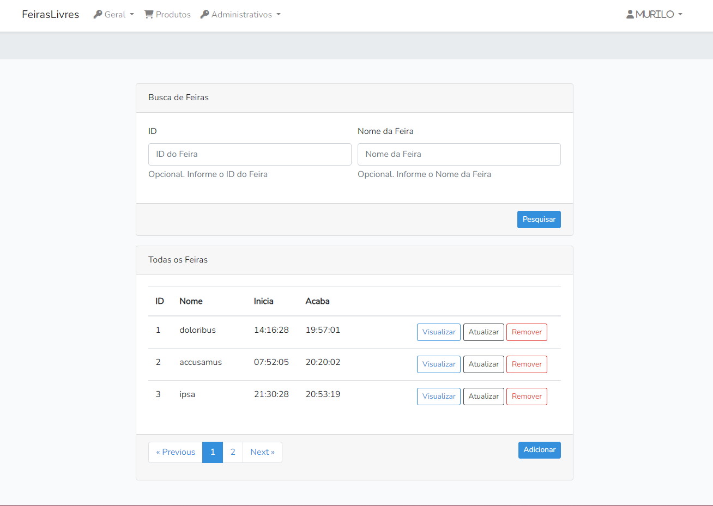
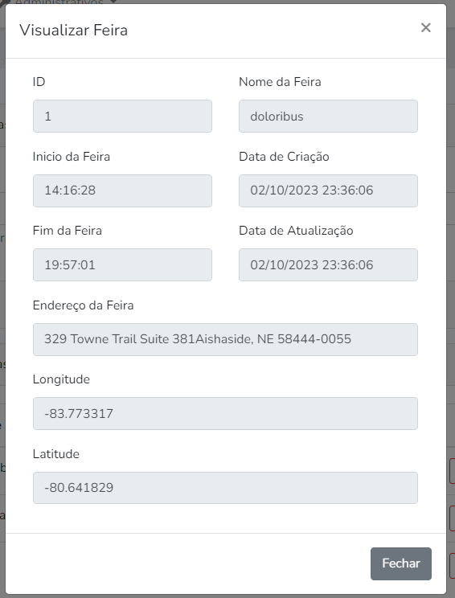
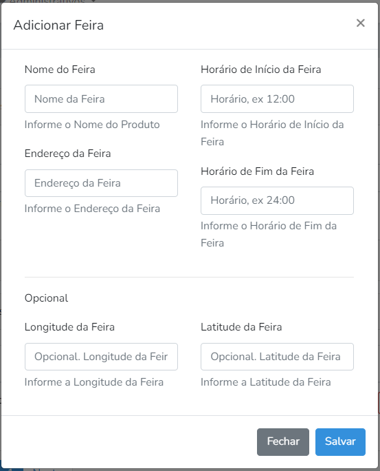
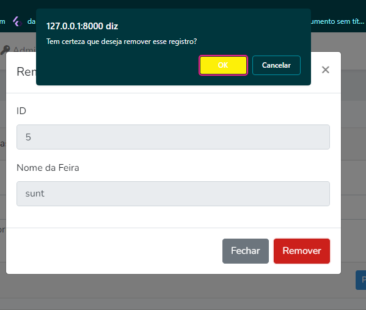

*Após clonar o Projeto:*
1. `composer install` (via terminal, apontando para dentro da pasta do projeto)
   
2. `npm install`

3. Criar um cópia do arquivo .env.example e renomeá-la para .env

4. `php artisan key:generate` (via terminal, apontando para dentro da pasta do projeto)

5. Rode as instancias de `php artisan serve` e `npm run watch`
   
---

1. **Inicializando o Projeto:**
   
`composer create-project –prefer-dist laravel=8.5.9 FeirasLivres`

2. **Instalando o Pacote UI:**
   
`composer require laravel/ui:^3.2.1`

3. **Gerando o Esqueleto do Projeto com Vue.JS e Autenticação Web Nativa (Scaffold):**
   
`php artisan ui vue --auth`

4. **Baixando Dependências do Front-end:**
   
`npm install`

5. **Rodando o Vue.js:**
   
`npm run dev` + `php artisan serve`

[Em caso de problemas após o último passo, rode novamente o Passo 4 e repita o Passo 5]()

## Assets do Projeto ##

 
### Assets do Projeto ###
#### Login ####

#### Register ####

#### CRUD Feiras ####

## **Pacotes Instalados pelo Npm**

### **vue@2.7.14**
*Descrição:* Uma biblioteca progressiva para a construção de interfaces de usuário interativas.

### **bootstrap@4.6.2**
*Descrição:* Um popular framework de front-end para a criação de interfaces web responsivas e atraentes.

### **jquery@3.7.1**
*Descrição:* Uma biblioteca JavaScript rápida, pequena e rica em recursos, utilizada para manipular o DOM e simplificar a interação com o HTML.

### **axios@0.21.4**
*Descrição:* Cliente HTTP que pode ser usado tanto no navegador quanto no Node.js. É especialmente útil para fazer requisições AJAX.

---

## **Pacotes Instalados pelo Composer**

### **fakerphp/faker@1.23.0**
*Descrição:* Gera dados falsos para testes e desenvolvimento.

## **tymon@2.0.0**
*Descrição:* tymon inclui a implementação de autenticação JSON Web Token (JWT) para Laravel e Lumen, por meio do pacote jwt-auth.

---

## Learning Laravel.[^1]
[^1]: Laravel has the most extensive and thorough [documentation](https://laravel.com/docs) and video tutorial library of all modern web application frameworks, making it a breeze to get started with the framework. If you don't feel like reading, [Laracasts](https://laracasts.com) can help. Laracasts contains over 1500 video tutorials on a range of topics including Laravel, modern PHP, unit testing, and JavaScript. Boost your skills by digging into our comprehensive video library.

## Contributing.[^2]
[^2]: Thank you for considering contributing to the Laravel framework! The contribution guide can be found in the [Laravel documentation](https://laravel.com/docs/contributions).

## License.[^3]
[^3]: The Laravel framework is open-sourced software licensed under the [MIT license](https://opensource.org/licenses/MIT).

